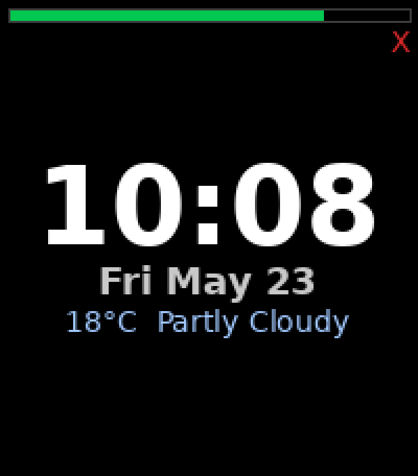
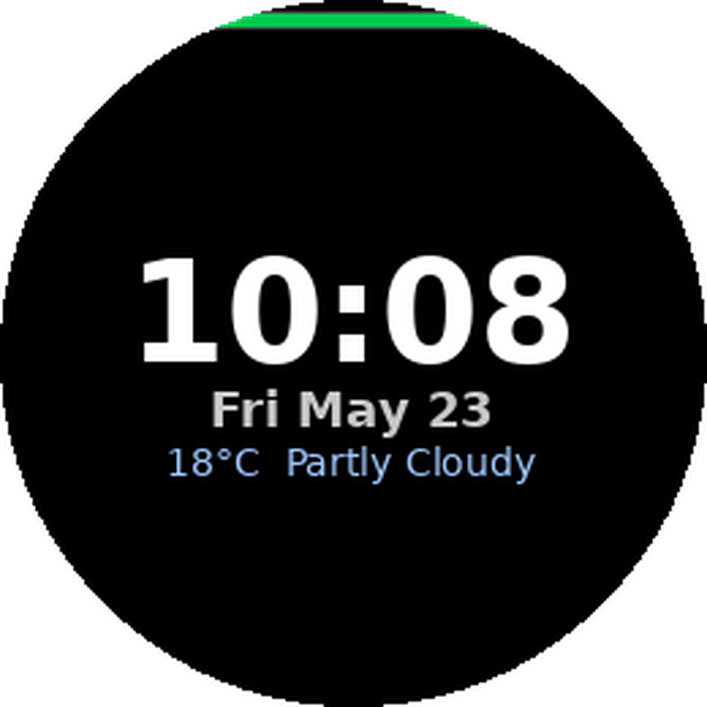
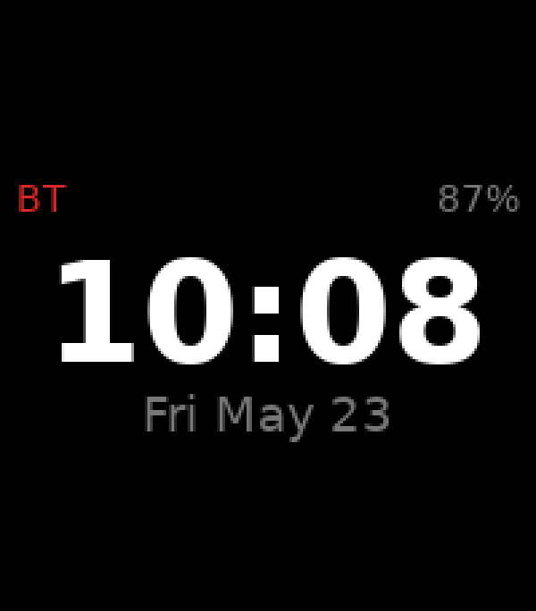
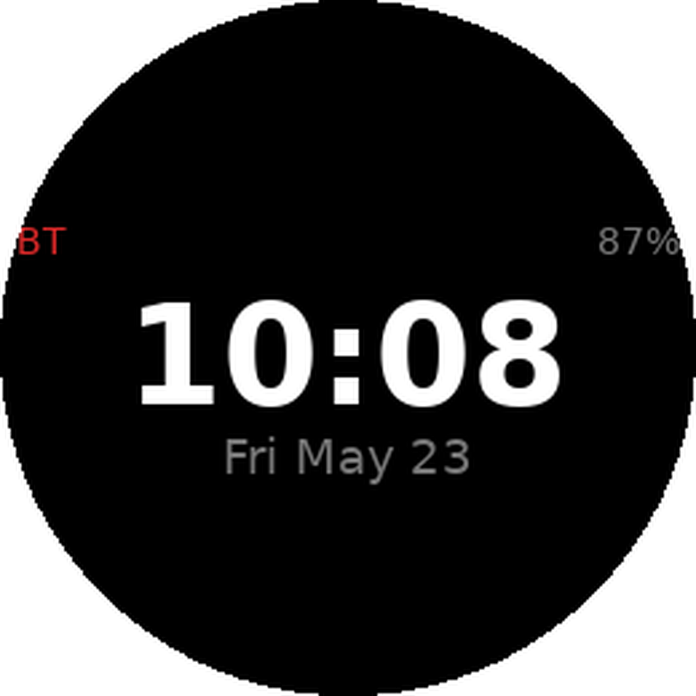
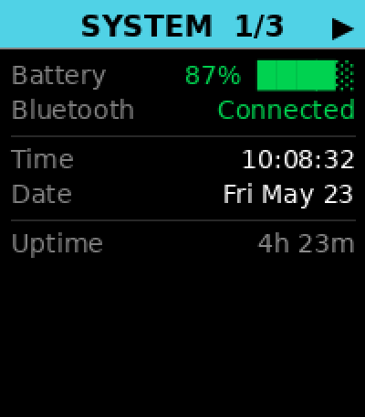
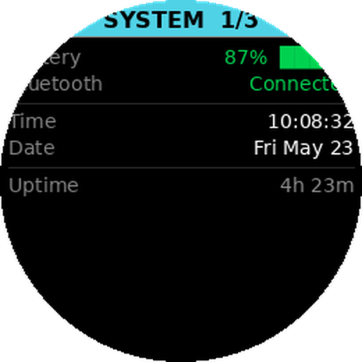
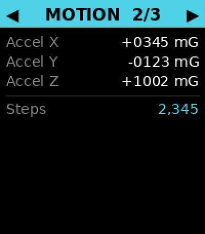
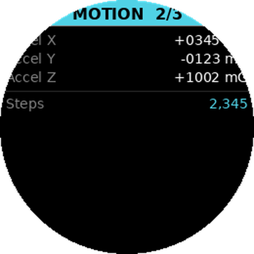
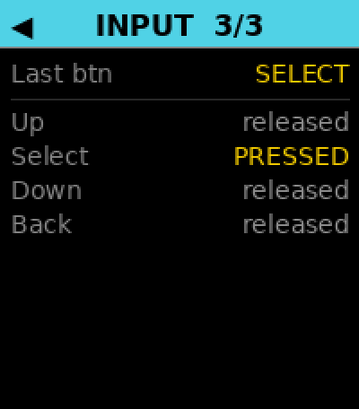
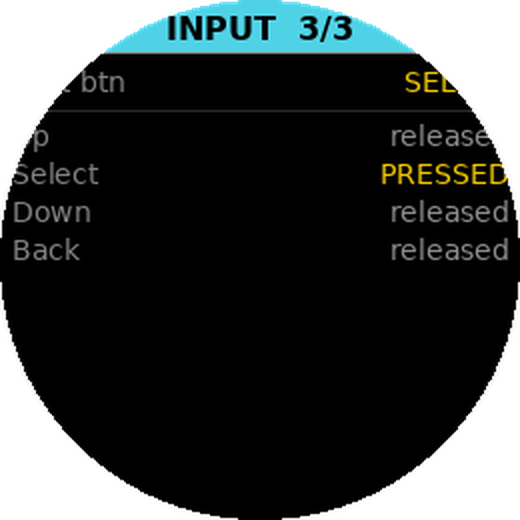

# Pebble Duo 2 Apps

App collection for the **Pebble 2 Duo** built with [Alloy](https://developer.repebble.com/guides/alloy/) — Pebble's modern JavaScript SDK powered by Moddable/XS.

---

## Apps

### Tutorial Watchface
> Follows the official 6-part Alloy watchface tutorial to completion.

| Emery (200×228) | Gabbro (260×260) |
|:-:|:-:|
|  |  |

- Digital time and date with Jersey10 bitmap fonts
- Battery bar with charge-level colour coding (green / yellow / red)
- Bluetooth disconnect indicator
- Live weather via [Open-Meteo](https://open-meteo.com/) (no API key required)
- 1-hour weather cache; refreshes every 30 minutes
- User settings via Clay: temperature unit, colours, 12/24-hour format, date toggle

### Minimalist Digital
> Clean, distraction-free watchface with no network calls.

| Emery (200×228) | Gabbro (260×260) |
|:-:|:-:|
|  |  |

- Large digital time centred on screen
- Date in muted grey below
- Battery percentage top-right (turns red at ≤ 20%)
- "BT" indicator top-left only when disconnected from phone

### Sensor Diagnostics
> Hardware health tool — opens from the menu, navigate pages with Up/Down, exit with Back.

| Page | Emery (200×228) | Gabbro (260×260) |
|:--|:-:|:-:|
| System |  |  |
| Motion |  |  |
| Input  |   |   |

- **System page**: battery bar (colour-coded), Bluetooth state, live time/date, uptime
- **Motion page**: accelerometer X/Y/Z in milli-G (live, 1 Hz), step count via health API
- **Input page**: last button pressed, live held/released state for all four buttons
- All sensor reads are wrapped in try/catch — unavailable sensors show "N/A"
- No pkjs companion, no network calls, no dependencies

---

## Getting Started

**Prerequisites**
- [Pebble SDK](https://developer.repebble.com/sdk/) installed
- Node.js (for `npm install` in apps with dependencies)

**Build**
```sh
cd tutorial-watchface   # or minimalist-digital or sensor-diagnostics
npm install             # only needed for tutorial-watchface
pebble build
```

**Test on emulator**
```sh
pebble install --emulator emery    # Pebble Time 2  (200×228)
pebble install --emulator gabbro   # Pebble Round 2 (260×260)
```

**Install on device**
Sideload the compiled `.pbw` from the `build/` directory via the Pebble phone app.

---

## Project Structure

```
Pebble-apps/
├── assets/                          # mockup images
│   ├── tutorial-emery.png
│   ├── tutorial-gabbro.png
│   ├── minimalist-emery.png
│   ├── minimalist-gabbro.png
│   ├── diagnostics-emery-p{1-3}.png
│   └── diagnostics-gabbro-p{1-3}.png
├── tutorial-watchface/
│   ├── package.json
│   └── src/
│       ├── embeddedjs/main.js       # watch-side rendering + logic
│       └── pkjs/
│           ├── index.js             # phone-side weather fetch + Clay
│           └── config.js            # Clay settings UI
├── minimalist-digital/
│   ├── package.json
│   └── src/
│       └── embeddedjs/main.js       # watch-side only
└── sensor-diagnostics/
    ├── package.json
    └── src/
        └── embeddedjs/main.js       # 3-page sensor readout, no pkjs
```

---

## Changelog

### 2026-05-23
**Initial release**
- Added `tutorial-watchface` — complete Alloy tutorial (parts 1–6) with weather, Clay settings, and localStorage caching
- Added `minimalist-digital` — no-dependency watchface with time, date, battery %, and BT indicator
- Added `CLAUDE.md` with full project context, API reference, and build notes
- Added watchface mockups for both apps on emery and gabbro displays (`assets/`)

### 2026-05-23 (continued)
- Added `sensor-diagnostics` — 3-page watchapp showing battery, BT, time, accelerometer X/Y/Z, step count, and live button state; graceful N/A for absent sensors
- Added diagnostics mockups for all 3 pages on emery and gabbro (`assets/diagnostics-*`)

### 2026-05-23 (layout fixes)
- `tutorial-watchface`: fixed disconnect "X" overlapping the battery bar; clamped centred content to never collide with top chrome
- `minimalist-digital`: moved battery % and BT indicator into the vertically-centred content block — previously both were clipped off-screen on the gabbro round display
- `sensor-diagnostics`: merged header title and page number into one line to fix overlap; fixed `drawDivider` drawing at the wrong position (lines were rendering on top of row text); rewrote all four divider call sites with correct gap pattern
- Regenerated all mockups to reflect corrected layouts
- Added Layout Rules section to `CLAUDE.md` documenting safe-zone, divider, and centring guidelines
